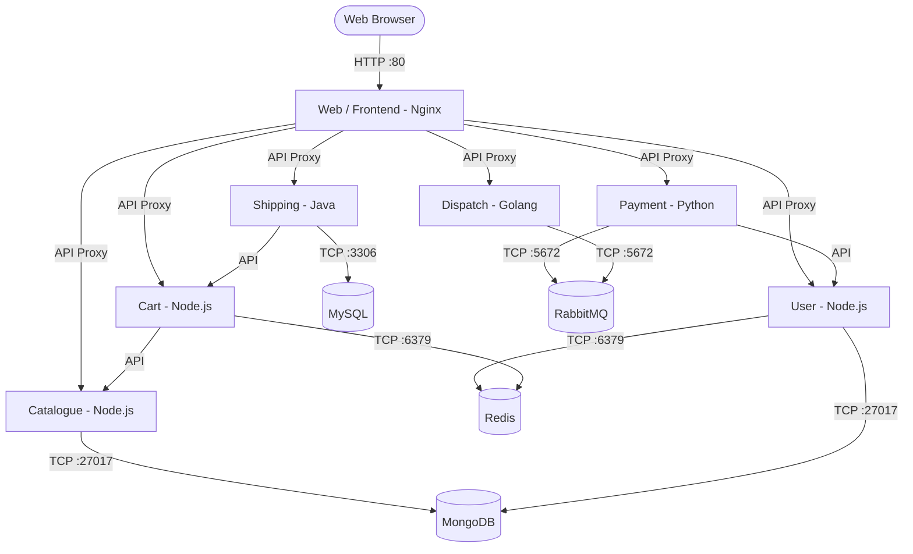

# 🛒 RoboShop Kubernetes Microservices Project (`k8-roboshop`)

This repository contains Kubernetes manifest files, service networking definitions, configuration decouplings, and operational best practices for deploying the **RoboShop E-Commerce Microservices Application** on a Kubernetes cluster (AWS EKS / Minikube).

---

## 📑 Project Architecture & Components

RoboShop is a distributed 3-tier e-commerce application comprising databases, backend microservices, and a frontend web application:



---

## 📁 Repository Structure & Manifest Tracker

| Component / Layer | Directory / File | Resource Kind(s) | Port(s) | Description |
| :--- | :--- | :--- | :--- | :--- |
| **Namespace** | [`namespace.yaml`](file:///Users/sriramcharankolla/Desktop/DevOps/k8-roboshop/namespace.yaml) | `Namespace` | N/A | Dedicated `roboshop` namespace for project isolation |
| **Database** | [`mongodb/manifest.yaml`](file:///Users/sriramcharankolla/Desktop/DevOps/k8-roboshop/mongodb/manifest.yaml) | `Deployment`, `Service` | `27017` | NoSQL database for Catalogue & User microservices |
| **Caching** | `redis/` *(Upcoming)* | `Deployment`, `Service` | `6379` | In-memory key-value cache for User sessions & Cart |
| **Relational DB** | `mysql/` *(Upcoming)* | `Deployment`, `Service` | `3306` | Relational database for Shipping transactions & countries |
| **Message Queue** | `rabbitmq/` *(Upcoming)* | `Deployment`, `Service` | `5672` | AMQP Message Broker for asynchronous payment dispatching |
| **Microservice** | [`catalogue/manifest.yaml`](file:///Users/sriramcharankolla/Desktop/DevOps/k8-roboshop/catalogue/manifest.yaml) | `ConfigMap`, `Deployment`, `Service` | `8080` | Node.js backend managing product catalog & categories |
| **Microservice** | `user/` *(Upcoming)* | `Deployment`, `Service` | `8080` | Node.js backend managing customer authentication & logins |
| **Microservice** | `cart/` *(Upcoming)* | `Deployment`, `Service` | `8080` | Node.js backend managing items added to user shopping cart |
| **Microservice** | `shipping/` *(Upcoming)* | `Deployment`, `Service` | `8080` | Java Spring Boot microservice calculating shipping rates & orders |
| **Microservice** | `payment/` *(Upcoming)* | `Deployment`, `Service` | `8080` | Python microservice handling payment processing & queues |
| **Microservice** | `dispatch/` *(Upcoming)* | `Deployment`, `Service` | `8080` | Golang worker daemon processing order fulfillment |
| **Frontend** | `frontend/` *(Upcoming)* | `Deployment`, `Service` | `80` | Nginx reverse proxy serving Web UI & routing `/api` calls |

---

## 🚀 Deployment Instructions

### 1. Create Dedicated Project Namespace & Switch Context
Always deploy the `namespace.yaml` first to isolate RoboShop resources from the `default` namespace:

```bash
# 1. Apply Namespace
kubectl apply -f namespace.yaml

# 2. Switch default namespace to 'roboshop' using kubens (Avoids typing '-n roboshop' every time!)
kubens roboshop

# Verify current active namespace
kubens -c
```

---

### 2. Deploy Databases & State Storage

#### MongoDB (`mongodb/manifest.yaml`)
```bash
# Apply MongoDB Deployment & Service inside roboshop namespace
kubectl apply -f mongodb/manifest.yaml

# Verify Deployment, Pod, and Service
kubectl get deployment -n roboshop -l component=mongodb
kubectl get pods -n roboshop -l component=mongodb -o wide
kubectl get svc -n roboshop -l component=mongodb
```

---

### 3. Deploy Backend Microservices

#### Catalogue (`catalogue/manifest.yaml`)
```bash
# Apply Catalogue ConfigMap, Deployment, and Service
kubectl apply -f catalogue/manifest.yaml

# Verify Catalogue resources
kubectl get configmap -n roboshop catalogue
kubectl get deployment -n roboshop catalogue
kubectl get pods -n roboshop -l component=catalogue
kubectl get svc -n roboshop catalogue
```

---

## 🛠️ Kubernetes Best Practices Applied in RoboShop

1. **Namespace Isolation:**
   - All components are scoped under `namespace: roboshop` to prevent port collisions, organize RBAC permissions, and enable clear resource tracking.
2. **Declarative Deployments over Bare Pods:**
   - Utilizing `kind: Deployment` ensures automated pod self-healing, scaling, rolling updates with zero downtime, and rollback capabilities.
3. **Consistent Multi-Tier Labeling Strategy:**
   - Standard labels applied across all workloads:
     ```yaml
     labels:
       project: roboshop
       tier: db # or app, frontend
       component: mongodb # or catalogue, user, etc.
     ```
4. **Service Discovery via Kubernetes DNS:**
   - Services expose internal endpoints (e.g. `mongodb:27017`), allowing backend applications to discover dependencies using short service names within the same namespace.
5. **Reliable Transport Protocol (TCP):**
   - Explicit `protocol: TCP` configured for connection-oriented, acknowledged communication between microservices and databases.

---

## 🔍 Verification & Debugging Commands

```bash
# Check all resources inside roboshop namespace
kubectl get all -n roboshop

# Check detailed pod status and events
kubectl describe pod -n roboshop -l component=mongodb

# View live container logs
kubectl logs -n roboshop -l component=mongodb -f

# Verify Service Endpoints mapping
kubectl get endpoints -n roboshop
```

---

## ⚡ `kubens` & `kubectx` — Fast Namespace & Context Management

Managing namespaces and clusters with standard `kubectl -n <namespace>` commands can become repetitive. `kubens` and `kubectx` provide instant switching and bash auto-completion.

### 1. Installation & Shell Auto-Completion Setup
```bash
# Clone kubectx repository to user/system directory
git clone https://github.com/ahmetb/kubectx.git ~/.kubectx

# Create symlinks to /usr/local/bin for global CLI access
sudo ln -sf ~/.kubectx/kubectx /usr/local/bin/kubectx
sudo ln -sf ~/.kubectx/kubens /usr/local/bin/kubens

# Setup bash autocompletion
COMPDIR=$(pkg-config --variable=completionsdir bash-completion 2>/dev/null || echo "/etc/bash_completion.d")
sudo mkdir -p "$COMPDIR"
sudo ln -sf ~/.kubectx/completion/kubens.bash "$COMPDIR/kubens"
sudo ln -sf ~/.kubectx/completion/kubectx.bash "$COMPDIR/kubectx"
```

### 2. Namespace Switching Workflow (`kubens`)
Once configured, `kubens` sets the default namespace in your `kubeconfig` so you don't need to specify `-n roboshop` with every command:

```bash
# 1. Switch active namespace to 'roboshop':
kubens roboshop
# Output: Active namespace is "roboshop"

# 2. Query resources without passing '-n roboshop':
kubectl get pods       # Automatically queries pods in 'roboshop' namespace
kubectl get svc        # Automatically queries services in 'roboshop' namespace
kubectl get cm         # Automatically queries configmaps in 'roboshop' namespace

# 3. Switch back to 'default' namespace:
kubens default
# Output: Active namespace is "default"

# 4. Query resources in default namespace:
kubectl get pods       # Queries 'default' namespace (No pods found if nothing is deployed in default)

# 5. Switch back to 'roboshop' namespace:
kubens roboshop

# 6. Toggle back to previous namespace instantly:
kubens -
```

### 3. Cluster Context Switching (`kubectx`)
```bash
# List all configured cluster contexts:
kubectx

# Switch active cluster context:
kubectx <cluster-name>

# Toggle back to previous cluster context:
kubectx -
```

---

## 🐶 `K9s` — Kubernetes Terminal UI Supercharger Guide

`k9s` provides a powerful, curses-based terminal UI to interact, observe, navigate, and debug Kubernetes clusters in real time.

### 1. Installation & Launching K9s

```bash
# Install k9s via webinstall or package:
curl -sS https://webinstall.dev/k9s | bash

# Launch k9s in active namespace:
k9s

# Launch directly in roboshop namespace:
k9s -n roboshop

# Launch in all namespaces:
k9s -A
```

---

### 2. Core Navigation & Resource Switching

| Shortcut / Key | Mode / Action | Description |
| :--- | :--- | :--- |
| `Shift + :` (or `:`) | **Command Mode** | Opens command prompt at top. Type resource alias and press `Enter` |
| `/` | **Filter / Search** | Type keyword to filter listed items in real time (e.g. `/catalogue`) |
| `Esc` | **Back / Clear** | Go back to previous screen or clear filter |
| `Ctrl + C` / `:q` | **Quit** | Exit K9s UI |
| `Enter` | **Drill Down** | Inspect Pod containers, view resource details |

---

### 3. Popular Resource Jump Commands (`Shift + :`)

| Command | Resource Type |
| :--- | :--- |
| `:po` / `:pods` | View **Pods** |
| `:deploy` / `:deployments` | View **Deployments** |
| `:svc` / `:services` | View **Services** |
| `:cm` / `:configmaps` | View **ConfigMaps** |
| `:sec` / `:secrets` | View **Secrets** |
| `:ns` / `:namespaces` | View & Switch **Namespaces** |
| `:nodes` / `:no` | View Worker **Nodes** (CPU & Memory utilization) |
| `:ctx` / `:contexts` | Switch Kubernetes **Cluster Contexts** |
| `:pulse` | Cluster **Health Dashboard** |
| `:xray deploy` | Interactive **Dependency Tree** of Deployments |

---

### 4. Workload Actions & Debugging Shortcuts (Inside Pods/Deployments View)

| Key | Action | What it does |
| :--- | :--- | :--- |
| `l` | **View Logs** | Opens streaming logs of the selected Pod |
| `s` | **Shell (Exec)** | Opens an interactive `/bin/sh` or `/bin/bash` terminal inside the container (`exit` to leave) |
| `d` | **Describe** | Shows `kubectl describe` output with events & status |
| `e` | **Edit YAML** | Opens live YAML in Vim/Nano to edit on the fly |
| `y` | **View YAML** | View complete YAML definition without editing |
| `w` | **Wrap Lines** | Toggles line wrapping in log viewers |
| `Ctrl + d` | **Delete Pod** | Deletes the selected Pod (Great to test ReplicaSet/Deployment **Self-Healing**) |
| `Shift + f` | **Port Forward** | Maps Pod/Service port to `localhost` on your machine |

---

## 🛠️ Kubernetes Troubleshooting & Debugging Guide

### 1. Common Cluster Connection Errors

#### 🔴 Error: `failed to download openapi: Get "http://localhost:8080/openapi/v2": dial tcp [::1]:8080: connect: connection refused`

- **Root Cause**: `kubectl` cannot locate a valid cluster configuration file (`~/.kube/config`). By default, it falls back to querying `http://localhost:8080`, where no API server is listening.
- **Occurrence**: Happens when newly provisioning an EC2 workstation or creating a fresh EKS cluster without updating local credentials.

**Fix / Solution:**
Update your local `kubeconfig` with credentials from AWS EKS:
```bash
# Update kubeconfig for your cluster (replace region and cluster name as appropriate)
aws eks update-kubeconfig --region us-east-1 --name roboshop

# Verify cluster connectivity
kubectl get nodes

# Verify current active context
kubectl config current-context
```

---

### 2. General Pod & Workload Debugging Flow

When pods fail to start or services misbehave, use this systematic step-by-step approach:

#### Step 1: Check Pod Status
```bash
kubectl get pods -n roboshop -o wide
```
- Look for statuses such as `CrashLoopBackOff`, `ImagePullBackOff`, `Pending`, or `Error`.

#### Step 2: Inspect Events & Details (`describe`)
```bash
kubectl describe pod <pod-name> -n roboshop
```
- Check the **Events** section at the bottom to identify failures (e.g., node resource constraints, volume mount issues, failed probes, invalid image tags).

#### Step 3: Inspect Logs
```bash
# View current logs
kubectl logs <pod-name> -n roboshop

# View logs from a previous crashed container instance
kubectl logs <pod-name> -n roboshop --previous

# Follow/stream real-time logs
kubectl logs -f <pod-name> -n roboshop
```

#### Step 4: Shell into the Container (Exec)
```bash
kubectl exec -it <pod-name> -n roboshop -- /bin/sh
```
- Test internal connectivity (e.g., `nc -zv mongodb 27017` or `curl http://catalogue:8080/health`).


